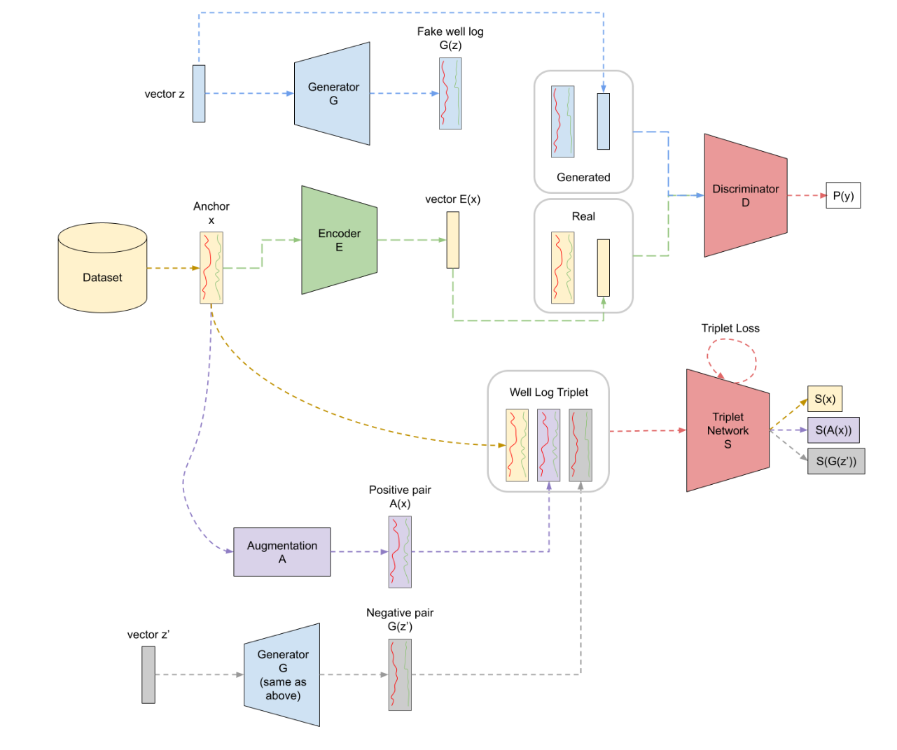
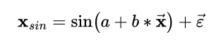

# Generative Triplet Model for Well Log Similarity

This model consists of a self-supervised triplet approach that levers the generative capability of GANs to evaluate well log similarity.

# Execution

To execute the WellGT training software, follow these bash commands:

```
cd frente-5-gan
python3 train.py --model <model> --dataset <dataset> --run <x>
```

Replace `<model>` and `<dataset>` with the desired model and dataset options respectively. Additionally, `<x>` indicates the number of the execution. 

### Available Models:
- WellGT (wellgt)(**Ours**)

Our model is showed below:



#### Baselines:
- Bootstrap Your Own Latent (byol)
- Dynamic Time Warp (DTW)(No training)
- Triplet Romanenkova (romanenkova)
- Variational AutoEncoder (vae)

### Available Datasets:
- Force (force)
- Taranaki (taranaki)
- Force and Taranaki (public)
    
All execution parameters:
    
| Command          | Description                                                                     | Default Value     | Possible Values              |
|------------------|---------------------------------------------------------------------------------|-------------------|------------------------------|
| --model          | Name of the desired model.                                                      | 'wellgt'          | Any implemented model name   |
| --dataset        | Desired dataset for training and testing model.                                 | 'public'          | Any implemented dataset name |
| --seq_size       | Input sequence size (in data points, not meters/feet).                          | 256               | Positive integer             |
| --interval_size  | Minimum interval between the first value of two selected sequences.             | 128               | Positive integer             |
| --lr             | Learning rate used to train models                                              | 0.0001            | Positive float               |
| --weight_decay   | Weight Decay used by the optimizer                                              | 0.00001           | Positive float               |
| --batch_size     | Batch size used to train the model                                              | 32                | Positive integer             |
| --epochs         | Number of epochs used to train the model                                        | 500               | Positive integer             |
| --feature_size   | Size of the embeddings created by the models                                    | 256               | Positive integer             |
| --z_size         | Size of the latent vector z used by the generator in WellGT                     | 100               | Positive integer             |
| --split_method   | Method used for splitting data.                                                 | 'cv'              | Any implemented split method |
| --initial_margin | Initial margin value for the triplet loss margin parameter.                     | 0.1               | Positive float               |
| --final_margin   | Final margin value for the triplet loss margin parameter in the last epoch.     | 0.1               | Positive float               |
| --half_life      | Number of epochs before the margin is half its initial value.                   | 100               | Positive integer             |
| --swap           | Swap hyperparameter value for the triplet loss.                                 | True              | True, False                  |
| --half_life      | Number of epochs before the margin is half its initial value.                   | 100               | Positive integer             |
| --save_model     | Wether to save or not the trained model after training.                         | True              | True, False                  |
| --save_dir       | Directory used for saving the model.                                            | model-checkpoints | Any existing path            |
| --output_dir     | Directory used for saving the model evaluation results.                         | results           | Any existing path            |
| --config_dir     | Directory used for loading the config yml files.                                | configs           | Any existing path            |
| --verbose        | Print the evolution of steps during execution                                   | False             | True, False                  |
| --run            | Number of the code execution (useful for multiple runs using the same configs). | 1                 | Positive integer             |

For example, to run the training code with the Variational Autoencoder on the Force dataset, the command would be:

python3 benchmark.py --model vae --dataset force

# Configs

The 'configs' directory has '.yml' files that hold the necessary parameters to run the code properly.

### `data.yml`: 

#### This file contains necessary information to perform the methods.

| Field          | Description                                                    | Default Value                | Possible Values           |
|----------------|----------------------------------------------------------------|------------------------------|---------------------------|
| scaling_method | Method for scaling the data.                                   | 'standard'                   | 'standard', 'minmax'      |
| columns_used   | Logs used to train models.                                     | 'GR', 'RHOB', 'NPHI', 'DTC'  | Any list of existing logs |
| num_channels   | Number of channels (logs). Length of columns_used.             | 4                            | Positive integer          |

### `<dataset>.yml` files:

There are three YAML configuration files named `<dataset>`.yml, where `<dataset>` can be replaced with 'force', 'taranaki'. These files require modification in the data_dir parameter to specify the directory where the dataset is stored.

Example:

* **force.yml**: Configuration file for the 'force' dataset.
* **taranaki.yml**: Configuration file for the 'taranaki' dataset.

In each of these YAML files, locate the data_dir parameter and set its value to the directory path where the respective dataset is stored.

## Methodology:

In our paper and technical report, we have justified our decision to use four key well logs in our approach: *Gamma Ray, Density, Neutron, and Compressional Wave*. We selected these logs because they are properties that are highly influenced by rock types and exhibit a degree of completeness, meaning they are less susceptible to missing data issues.

For evaluation, we use three experiments and each have their own metrics:

### Sinusoidal Ranking

A sinusoidal curve dataset composed of sequences is generated through the formula:



The number of sequences is a hyperparameter selected when generating the dataset. The goal of similarity in this experiment: sinusoidal sequences with close frequencies, regardless of the phase, are similar, while sequences with different frequencies are dissimilar.

To evaluate the performance in this experiment, the following metrics are used:

- **MAP@k** (Mean Average Precision at *k*): Check the presence of top *k* relevant elements in top *k* predicted elements.
- **MRR@k** (Mean Reciprocal Rank at *k*): Give scores based on the position of the predicted sequences in the ground truth ranking.

### Augmentation Ranking

As augmentation is our goal related to similarity, that is, we want the anchor and its augmentation to be similar, another approach to evaluate the models is by ranking the entire dataset with one augmentation of the query image in it. The goal is to establish where the models would rank the augmentation considering they are what is expected from well-log similarity. According to the augmentation's position, metrics are established to evaluate the performance of all the models.

To measure the performance, we use the following metrics:

- **Accuracy@k**: Checks if the augmentation is within the top *k* predicted elements.
- **MRR** (Mean Reciprocal Rank): Assigns scores based on the position of the augmentation in the predicted ranking.
